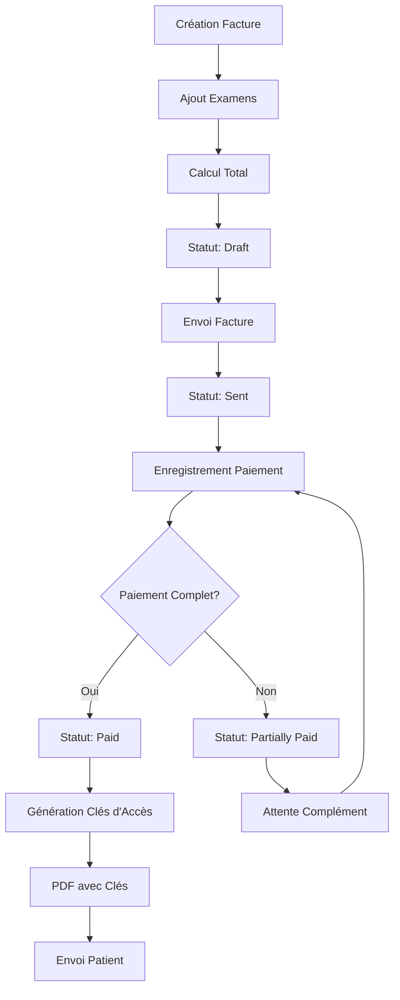

# 💰 Workflow de Facturation et Paiement CIMEF

## 🔄 Processus Complet de Facturation

### **Étape 1 : Création de Facture**
```
Secrétaire/Admin → Sélection Patient → Ajout Examens → Génération Facture
```

#### **Automatisations**
- **Numéro facture** : Format `FAC-XXXXXX` (auto-incrémenté)
- **Calculs automatiques** : Sous-total + taxes + total
- **Date d'échéance** : Configurable selon politique

#### **Modèle Invoice**
```python
class Invoice(models.Model):
    STATUS_CHOICES = [
        ('draft', 'Brouillon'),
        ('sent', 'Envoyée'), 
        ('partially_paid', 'Partiellement payée'),
        ('paid', 'Payée'),
        ('cancelled', 'Annulée'),
    ]
    
    invoice_number = models.CharField(max_length=20, unique=True)
    patient = models.ForeignKey(Patient, on_delete=models.CASCADE)
    patient_access = models.OneToOneField(PatientAccess, null=True, blank=True)
    subtotal = models.DecimalField(max_digits=12, decimal_places=0)
    tax_rate = models.DecimalField(max_digits=5, decimal_places=2, default=0)
    total_amount = models.DecimalField(max_digits=12, decimal_places=0)
```

### **Étape 2 : Articles de Facture**
```python
class InvoiceItem(models.Model):
    invoice = models.ForeignKey(Invoice, related_name='items')
    exam_type = models.ForeignKey(ExamType, on_delete=models.CASCADE)
    quantity = models.PositiveIntegerField(default=1)
    unit_price = models.DecimalField(max_digits=10, decimal_places=0)
    total_price = models.DecimalField(max_digits=12, decimal_places=0)
```

#### **Calculs Automatiques**
- **Prix total item** : `quantity × unit_price`
- **Sous-total facture** : Somme de tous les items
- **Taxes** : `(subtotal × tax_rate) / 100`
- **Total final** : `subtotal + tax_amount`

## 💳 Système de Paiement

### **Modes de Paiement Supportés**
- **Espèces** : Paiement comptant
- **Orange Money** : Mobile money Orange
- **Wave** : Portefeuille électronique
- **Free Money** : Mobile money Free
- **Virement bancaire** : Transfert bancaire
- **Chèque** : Paiement par chèque
- **Carte de crédit** : Paiement par carte

### **Modèle Payment**
```python
class Payment(models.Model):
    invoice = models.ForeignKey(Invoice, related_name='payments')
    amount = models.DecimalField(max_digits=12, decimal_places=0)
    payment_method = models.CharField(max_length=20, choices=PAYMENT_METHODS)
    payment_date = models.DateTimeField()
    status = models.CharField(max_length=20, choices=STATUS_CHOICES)
    reference_number = models.CharField(max_length=100, blank=True)
    receipt_number = models.CharField(max_length=50, unique=True)
```

### **Génération Reçu Automatique**
- **Format** : `REC-YYYYMMDD-XXXXXX`
- **Unique** : Par jour avec incrémentation
- **PDF** : Génération automatique du reçu

## 🔄 Workflow Automatisé Complet

### **Processus Unifié : Facture → Paiement → Accès**



### **Déclencheurs Automatiques**

#### **1. Changement Statut Facture**
```python
def save(self, *args, **kwargs):
    # Créer automatiquement les clés d'accès patient
    if not self.patient_access and self.status in ['sent', 'paid']:
        self.create_patient_access()
```

#### **2. Enregistrement Paiement**
```python
def update_invoice_status(self):
    total_payments = self.invoice.payments.filter(status='completed').aggregate(
        total=models.Sum('amount')
    )['total'] or 0
    
    if total_payments >= self.invoice.total_amount:
        self.invoice.status = 'paid'
    elif total_payments > 0:
        self.invoice.status = 'partially_paid'
```

#### **3. Génération Clés d'Accès**
```python
def create_patient_access(self):
    # Vérifier accès existant
    existing_access = PatientAccess.objects.filter(
        patient=self.patient, is_active=True
    ).first()
    
    if existing_access and existing_access.is_valid:
        self.patient_access = existing_access  # Réutiliser
    else:
        # Créer nouvel accès permanent
        patient_access = PatientAccess.objects.create(
            patient=self.patient,
            created_by=self.created_by,
            is_active=True
        )
        self.patient_access = patient_access
```

## 📄 Génération PDF

### **Facture PDF avec Clés**
```python
def get_access_keys_info(self):
    if self.patient_access:
        return {
            'access_key': self.patient_access.access_key,
            'password': self.patient_access.password,
            'is_permanent': True  # Plus d'expiration !
        }
    return None
```

### **Contenu PDF Facture**
- **En-tête** : Logo + informations cabinet
- **Patient** : Nom, téléphone, adresse
- **Examens** : Liste détaillée avec prix
- **Totaux** : Sous-total, taxes, total
- **🔑 Encadré Clés** : Clé d'accès + mot de passe
- **Instructions** : Comment accéder au portail

### **Reçu de Paiement PDF**
- **Informations paiement** : Montant, mode, date
- **Référence** : Numéro de reçu unique
- **Facture liée** : Numéro et statut
- **Signature** : Cachet électronique

## 💡 Paiements Partiels

### **Gestion Intelligente**
```python
@property
def remaining_amount(self):
    total_payments = self.invoice.payments.filter(status='completed').aggregate(
        total=models.Sum('amount')
    )['total'] or 0
    return max(0, self.invoice.total_amount - total_payments)

@property  
def is_partial_payment(self):
    return self.amount < self.invoice.total_amount
```

### **Workflow Paiements Multiples**
1. **Premier paiement** : Facture → `partially_paid`
2. **Paiements suivants** : Cumul jusqu'au total
3. **Paiement final** : Facture → `paid` + Clés générées

## 🎯 API Endpoints Facturation

### **Factures**
- `GET /api/invoices/` : Liste avec filtres
- `POST /api/invoices/` : Création nouvelle facture
- `GET /api/invoices/{id}/` : Détail facture
- `PUT /api/invoices/{id}/` : Modification
- `GET /api/invoices/{id}/pdf/` : Téléchargement PDF

### **Paiements**
- `GET /api/payments/` : Liste paiements
- `POST /api/payments/` : Enregistrement paiement
- `GET /api/payments/{id}/receipt/` : Reçu PDF

### **Recherche Avancée**
- `GET /api/invoices/?status=sent&amount_min=50000`
- `GET /api/payments/?method=orange_money&date_from=2024-01-01`

## 📊 Statistiques Financières

### **Dashboard Comptable**
```python
class AccountantDashboardView(BaseDashboardView):
    def get(self, request):
        monthly_revenue = Invoice.objects.filter(
            created_at__date__gte=start_of_month
        ).aggregate(total=Sum('total_amount'))['total'] or 0
        
        pending_invoices = Invoice.objects.filter(
            status__in=['sent', 'partially_paid']
        ).order_by('-due_date')[:5]
```

### **Métriques Disponibles**
- **Revenus mensuels** : Somme factures payées
- **Factures en attente** : Status sent/partially_paid
- **Répartition paiements** : Par mode de paiement
- **Tendances** : Évolution mensuelle

## 🔄 Intégration Complète

### **Workflow Type Complet**
```
1. 👩‍⚕️ Secrétaire crée patient
2. 👨‍⚕️ Docteur réalise examen
3. 👩‍⚕️ Secrétaire génère facture + examens
4. 💰 Comptable enregistre paiement
5. 🤖 Système génère clés d'accès automatiquement
6. 📧 Patient reçoit clés par email/SMS
7. 🔐 Patient accède résultats (PERMANENT)
```

### **Avantages Système**
- **Automatisation** : Moins d'erreurs humaines
- **Traçabilité** : Historique complet
- **Flexibilité** : Paiements partiels supportés
- **Sécurité** : Clés uniques par patient
- **Performance** : Optimisé gros volumes

## 🎯 Points Clés

### **✅ Fonctionnalités Avancées**
- Génération automatique numéros facture/reçu
- Calculs automatiques taxes et totaux
- Paiements partiels avec suivi
- Clés d'accès permanentes (plus d'expiration)
- PDF avec clés intégrées
- Mise à jour statuts automatique

### **🔧 Optimisations**
- Index base de données pour recherches rapides
- Pagination pour gros volumes
- Filtres avancés par montant/date/statut
- API REST complète avec permissions

### **🛡️ Sécurité**
- Validation des montants (minimum 1 FCFA)
- Numéros de reçu uniques
- Clés d'accès sécurisées
- Permissions par rôle strictes

---

*Ce workflow garantit une facturation efficace, des paiements traçables et un accès patient sécurisé dans un processus entièrement automatisé.*
