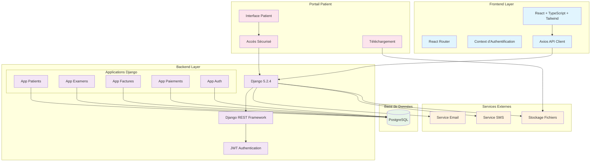

# 🏗️ Diagramme d'Architecture Système - CIMEF

## Vue d'ensemble de l'Architecture

## Technologies Utilisées

### **Frontend**
- **React 18** - Framework JavaScript moderne
- **TypeScript** - Typage statique pour JavaScript
- **Tailwind CSS** - Framework CSS utilitaire
- **Axios** - Client HTTP pour les requêtes API
- **React Router** - Routage côté client

### **Backend**
- **Django 5.2.4** - Framework web Python
- **Django REST Framework** - API REST
- **JWT** - Authentification par tokens
- **PostgreSQL** - Base de données relationnelle

### **Sécurité**
- **JWT Authentication** - Tokens sécurisés
- **CORS** - Politique de partage des ressources
- **Accès patient sécurisé** - Clé + mot de passe unique

### **Services**
- **Email** - Notifications automatiques
- **SMS** - Rappels et alertes
- **Stockage** - Fichiers d'examens sécurisés

## Flux de Données

1. **Authentification** : Login → JWT Token → Accès API
2. **Gestion Patients** : CRUD via API REST
3. **Examens** : Types + Fichiers + Résultats
4. **Facturation** : Génération PDF + Paiements
5. **Portail Patient** : Accès sécurisé + Téléchargement

## Avantages de cette Architecture

- **Séparation des responsabilités** (Frontend/Backend)
- **Scalabilité** (API REST stateless)
- **Sécurité** (JWT + accès contrôlé)
- **Maintenabilité** (Structure modulaire)
- **Performance** (React SPA + API optimisée)
